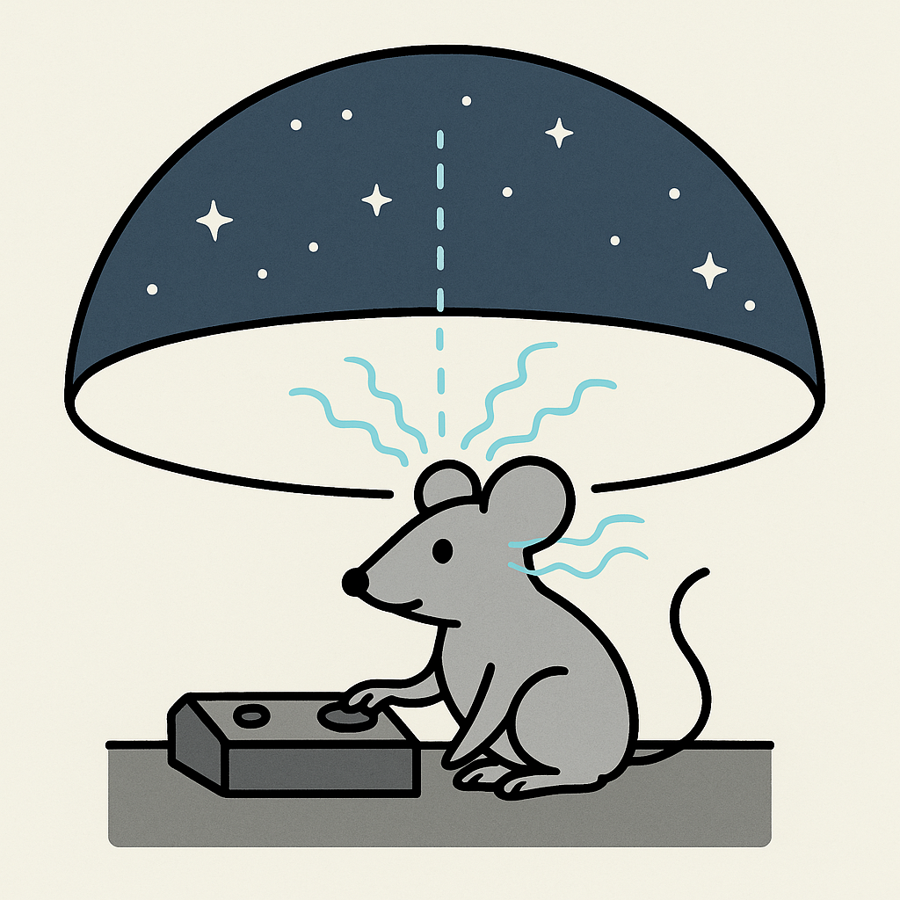

# Welcome to CLOOSE! 
# 1. Overview
Pipeline for running BCI experiments and online analysis of 1 and 2 photon imaging data

Copyright (C) 2025  Massachusetts Institute of Technology

## Paper Abstract

Brain-Computer Interfaces (BCI) have catalyzed advancements in both clinical applications and basic neuroscience research. However, technical barriers such as steep learning curves and complex synchronization requirements often impede their widespread adoption. In response to the increasing demand for optical closed-loop experiments and to the technical challenges associated with their implementation, we introduce CLOOSE (Closed-loop Optical Open-Source Experiments), a versatile platform designed to seamlessly perform closed-loop experiments on optical data. CLOOSE can easily interfaced with any frame-based imaging acquisition systems via a TCP/IP connection for data stream. Through benchmark tests, we validate CLOOSE's capability in ensuring real-time accurate image registration on both dense and sparse data, signal processing, and analysis at imaging frequencies of 1 kHz and above, making CLOOSE the first optical BCI compatible with voltage imaging. Throughout the paper we showcase CLOOSE's versatility in supporting several neurofeedback paradigms (from single neuron to population dynamics), multiplane imaging, and online z-tracking. CLOOSE functionality can be easily exploited by users with minimal coding ability thanks to an intuitive graphical user interface used to parametrize experiments and visualize tracking of CLOOSE performance. CLOOSE aims to streamline, standardize, and democratize online image analysis and neurofeedback BCI experiments by significantly lowering the entry level for performing a wide range of technically challenging in vivo imaging experiments. 
 

This code was written by Valerio Francioni.
For support, please open an [issue](https://github.com/CLOOSE_MS/issues).

### CITATION

If you use this package in your research, please cite the [paper](BIORXIV):

Valerio Francioni, Anna Beltramini, Linlin Z Fan and Mark T. Harnett (2025). CLOOSE  : An open-source platform to perform optical closed-loop experiments.

The online motion correction algorythm is based on [this paper](https://opg.optica.org/ol/abstract.cfm?uri=ol-33-2-156)

## Before you start
Make sure you have the following toolboxes installed with your Matlab 
1. DSP System Toolbox
2. Signal Processing toolbox
3. Image Processing Toolbox
4. If you are planning on running your BCI experiments using visual stimuli as feedback, make sure you have Psychtoolbox installed. Details can be found [here](http://psychtoolbox.org/download).

## 2. Getting started
## Step 1 -  Make sure you can transfer imaging data via a TCP/IP connection internally
1. Open two instances of MATLB on the same machine
2. In the TCP_IP folder open stream_send_data.m in one instance of MATLAB
3. In the TCP_IP folder open stream_receive_data.m in the other instance of MATLAB
4. In the stream_send_data.m script, set the path to Generate_images folder (e.g. YourPath2GitHub\GitHub\CLOOSE_MS\Generate_images)
5. For this step, leave the IPv4 variable unchanged to 127.0.0.1 (Localhost) in both the stream_send_data.m and the stream_receive_data.m.
6. Run stream_send_data.m first, then run stream_receive_data.m
7. CONGRATULATIONS! YOU ARE STREAMING DATA BETWEEN TWO INSTANCES OF MATLAB 

## Step 2 -  Make sure you can transfer imaging data via a TCP/IP connection internally
1. Open two instances of MATLB on two different computers, connected to the same Network (ethernet will be faster but Wifi will work too)
2. In the TCP_IP folder open stream_send_data.m on PC
3. In the TCP_IP folder open stream_receive_data.m in the other PC
4. In the stream_send_data.m script, set the path to Generate_images folder (e.g. YourPath2GitHub\GitHub\CLOOSE_MS\Generate_images)
5. On the PC _sending_ data, set the IPv4 as the IPv4 of the receiving PC (e.g., 10.93.6.184). NB: You can find the IPv4 adress by typing ipconfig/all in your command window.
6. 5. On the PC _receiving_ data, set the IPv4 as the IPv4 of the sending PC (e.g., 10.18.1.121). 
8. Run stream_send_data.m first, then run stream_receive_data.m
9. CONGRATULATIONS! YOU ARE STREAMING DATA BETWEEN TWO DIFFERENT PCs.

## If you managed to run these two steps successfully you are 90% there. 
CLOOSE is setup to act at the receiving end of this process. All you have to do, is to stream data to it. The rest of the analysis can easily be setup using the GUI (next steps). All you have to do now, is to setup your acquisition machine (the PC where you are acquiring imaging data), in the same way as the stream_send_data.m is setup. 
## Critical steps for this are: 
1. Open a TCP/IP connection on your image acquisition device in the same way it's done in the stream_send_data.m script. xpixels is the number of lines in your image. ypixels is the number of columns in your image. Set buffsz to 20.  
```	
 tcpipServer = tcpip(IPv4, port, 'NetworkRole', 'client', ...
    		'InputBufferSize', (xpixels*ypixels*buffsz), 'Terminator', 'CR/LF');
fopen(tcpipServer);
```

2. Identify in your code where the variable encoding for your image is stored. Normally acquisition devices plot your imaging data so you can visualize them online. Look for plotting functions in your code and you should be able to find your image. 
3. Vectorize your image in the same way it's done in the stream_send_data.m script. In this case the vectorized image is the variable 'stack', which is tranformed into a column vector. NB The code below vectorizes a single frame (iframe)
```	
 vect_img = reshape(stack(:, :, iframe), [], 1);
```
4. Open CLOOSE and run your experiments.


## 3.1. Using the GUI: Parameters

The CLOOSE GUI is equipped with various settings to accommodate different experimental designs and uses. The user will set their path within the General Panel, and ensure all settings are correct for their specific experiment. The following parameters exist within the CLOOSE GUI: 
### General Panel
_Path_ : Directory where data will be saved 

_Trial Number_ : Readout of current trial number during the session

_% correct_ : Readout of percentage of trials that are correct

_% avers_ : Readout of percentage of trials that have been incorrect/aversive (Might go in future releases)

_Day_ : Current day of training 

### BCI Panel 
_Motion Corr_ checkbox : Opt to use CLOOSE online motion correction

_Stim Baseline_ checkbox : Opt to have stimuli or darkness presented during baseline

_Activity Levels_ Display: Readout of feedback during session

_Trials_ : Number of trials during BCI session / determines length of BCI session 

_Spatial freq_ : Spatial Frequency of the feedback stimulus 

_Angle_ : Target (Rewarded?) Angle during the closed-loop session

_Pixels(x)_ : Number of columns being acquired by image acquisition software 

_Lines (y)_ : Number of lines being acquired by image acquisition software

_Frames (z)_ : Lenght of a single trial in terms of number of frames

_Target_ : DF/F0 at which target is reached. Will be updated after baseline collection

_I.T.I_ : Inter trial Interval 

_Fold_ : For Scanbox users only. Folding factor, the same as it appears on the Scanbox GUI

_Baseline_ Push button: Starts running the baseline session

_Test_ Push button: Might be removed in future releases

_Reward_ Push button: Might be removed in future releases

### Drifting Gratings Panel
  
_Frames (z)_ : Number of frames that will be collected for the baseline recording

### ROI Panel 

_# frames_ : Number of frames streamed for motion correction / ROI drawing

_Plane #_ : Plane to use for BCI if doing multi-plane imaging 

_Plane tot._ : Total numbers of planes acquired during imaging 

_Selection (Mean, Max, Std, All Frames)_ : How to generate image for motion correction / ROI - We reccomend using mean

_Load Image_ Push button: for streaming image for motion correction / ROI drawing

_Draw ROI_ Push button: For manually drawing ROIs

_Load ROI_ Push button: For loading saved ROIs from previous sessions

_Save ROI_ Push button: For saving drawn or adjusted ROIs

_Alignment Only checkbox_ : Opt to use CLOOSE GUI for FoV/ROI alignment 

## 3.2. Using the GUI: Procedures

### Connecting with acquisition software (Scanbox)
If using Scanbox software for image acquisition, and TCP/IP connection is made between PCs, then the user must select “Network Stream” within the Scanbox GUI in order to stream imaging data to CLOOSE. Once this is checked, all frames acquired will stream to CLOOSE and visible within the GUI display. 
Motion correction
If the user is using the CLOOSE live/online motion correction, prior to baseline collection a motion correction image needs to be acquired and set. Using the “Load Image” feature within the ROI panel CLOOSE will prompt the user whether they want to acquire a new image or load a previous one. If choosing to load a new image for motion correction the user can then acquire using the image acquisition software and CLOOSE will stream a number of frames as specified by the “# frames” box to generate an image that is either the mean, maximum, standard deviation, or all frames, as specified within the panel. The user will then be prompted to answer whether this is the image they would like to use for motion correction or not. Once a given image has been chosen for motion correction, CLOOSE will have the user to select three positions within the image around which CLOOSE will create subfields to use for motion correction for faster and efficient processing. It is ideal to select points within the image that are both well in focus and are not dark so that the motion correction software has enough signal to use. For using CLOOSE for session-to-session FoV/ROI alignment, the user should check the “Alignment Only” box within the ROI Panel…. (?)
### ROI selection 
Once the motion correction is set the user can use the display to mark their ROIs; CLOOSE has options for both drawing new ROIs as well as loading ROIs from previous sessions. Using “Draw ROIs” will allow the user to outline ROIs by clicking once to lay vertices and finishing the polygon by double clicking. Vertices can also be moved after the polygon is finished to adjust to fix the ROI or can be moved completely using the grab tool. When all ROIs are drawn the user can “Save ROIs” to the path that was set. On following sessions saved ROI files can be loaded and slightly adjusted using the grab tool if necessary to fit the FoV of that session, individual vertices can likewise still be adjusted. 

### Baseline collection
Baseline can either be run with visual stimuli or without, determined by the selection box in the BCI Panel. The length of the baseline recording will be set to the numbers of frames input into the Frames (z) box within the Drifting Gratings Panel. Once the user selects the “Baseline” button on the BCI Panel, Matlab will take a few seconds to initiate the recording (?), once that is ready the user can start the recording from the image acquisition software. When the baseline recording has finished a new window displaying traces collected from each ROI will appear and the user can stop the recording within the image acquisition software. To assign each ROI to a given population, press any key within the Matlab command window and a window to assign each number ROI to population 1 or 2 will appear. For many uses of CLOOSE it is best to select ROIs that have good activity levels and high signal-to-noise ratio. Assigning multiple ROIs to each population will result in the F/F0 of each ROI being averaged across that population. ROIs, and the population they are assigned to, will be saved to the safe path; it is of note that only ROIs assigned to a population after baseline will be saved. 

### BCI Recording
Once ROIs are assigned and desired parameters are set then the BCI recording can begin by using the “Run BCI” button in the BCI Panel. The user will be prompted with the question of whether this session is Day 1; choosing yes will mean the BCI session will automatically use the baseline recording from that day whereas choosing otherwise will prompt the user to select a saved baseline recording file. If selecting a saved baseline recording CLOOSE will either select to use the baseline recorded that day or the selected baseline (based on…?). After that is established Matlab will again take a few seconds to initiate the recording (?), once that is ready the user can start the recording from the image acquisition software. The experiment will run for as many trials are specified within the Trials box of the BCI Panel. Within the activity display of this panel the user will see a continuous readout of the activity level/angle computed by the difference between the average F/F0 of each population. Likewise, within the display of the Drifting Gratings Panel there will be a readout of reward that is delivered and licking by the subject (?). During the experimental recording the display will show the frames streaming from the image acquisition, if the FoV moves during recording than adjustments can be made to realign with the ROIs. 
Output
While the BCI is running there will be a readout of trial number and percentage of trials that are both correct and incorrect/aversive within the General Panel. Upon completion of the session there will be three separate data files (.mat format) saved to the path for the ROIs belonging to each population, the baseline F/F0 activity, and the BCI session F/F0 activity.


## Outputs

Will describe the outputs here

# License

**This code is licensed under GPL v3 (no redistribution without credit, and no redistribution in private repos, see the [license](LICENSE) for more details).**

# Coming soon
See this **youtube [thread](SOME YOUTUBE LINK)** for GUI demonstrations.

### Logo
Logo was designed by ChatGPT :(:
